# All-in-one AI 教师减负与作业批改系统

> 前端开源基础来源：[yinuoguan/nengdou-ai-review-helper-web](https://github.com/yinuoguan/nengdou-ai-review-helper-web)。本项目结合一线教师实际教学流程进行了删改、重构与功能扩展。

>本人纯文科生 代码大部分是vibe出来的 但是功能我都是一遍遍测试通过的 不完善的地方欢迎大家指正！或者要增加什么功能也可以提出哦！

一套面向中小学教学场景的 AI 作业批改与教学管理系统。项目围绕“班级管理、作业发布、学生提交、AI 批改、教师复核、学生查看结果”建立教学闭环，并集成教师工具箱，支持客观题答题卡批分、批量作文图片检查和线下作业结果同步。

系统目标不是让 AI 替代教师，而是把重复、机械、耗时的批改与统计工作交给系统处理，把最终判断、评价和教学反馈权保留给教师。

> 线上体验地址：<https://yosem.vip>  
> 教师测试账号：`teacher1`，密码：`123456`  
> 学生测试账号：`student1`，密码：`123456`  
> 豆包 API Key 可在[火山引擎](https://www.volcengine.com/)申请。当前项目仍在持续开发中，正式部署请根据自己的服务器、数据库、Redis 和 AI 模型密钥完成配置。

## 项目亮点

- 支持管理员、教师、学生三类角色，按角色展示不同工作台和功能入口。
- 支持班级创建、学生管理、作业发布、学生在线提交、AI 自动批改、教师人工复核。
- 支持教师自定义 AI 批改规则，让 AI 按教师给定标准输出分数、评语和亮点。
- 支持 OpenAI 兼容模型配置，可由教师自定义模型 ID、API Key 和兼容端点。
- 支持教师工具箱：客观题答题卡识别批分、批量作文图片检查、工具批改记录、CSV 导出。
- 支持将线下图片批改结果同步回系统作业提交记录，打通线上线下批改数据。
- 支持 Docker / Docker Compose 部署，方便本地或服务器快速启动。
- 已优化移动端体验，方便教师和学生在不同设备上使用。

## 功能截图

这里预留项目截图和动图位置。建议图片统一放在 `public/README/` 目录下，命名清晰后再取消注释对应的图片语法。

### 1. 系统首页与统一登录

> 截图占位：展示系统首页、统一登录页、角色登录入口。

<!--

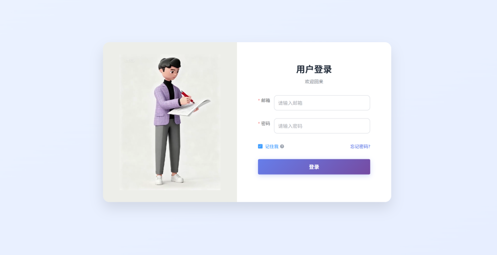
-->

### 2. 管理员端

> 截图占位：展示管理员看板、用户管理、角色/菜单权限、AI 模型配置。

<!--

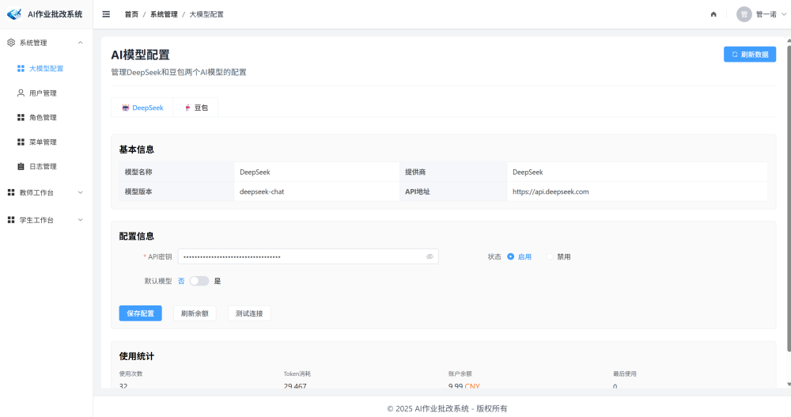
-->

### 3. 教师端核心流程

> 截图占位：展示教师教学中心、创建班级、批量添加学生、发布作业、配置 AI 规则、查看作业详情、人工复核。

<!--
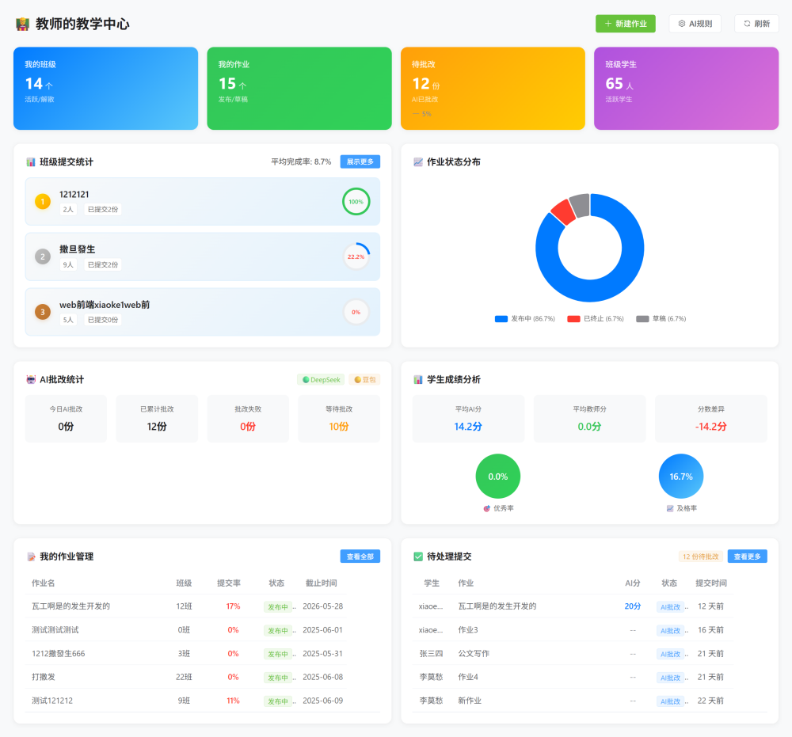
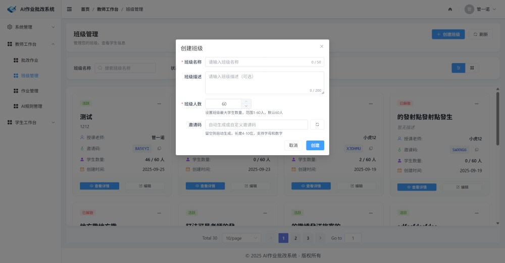
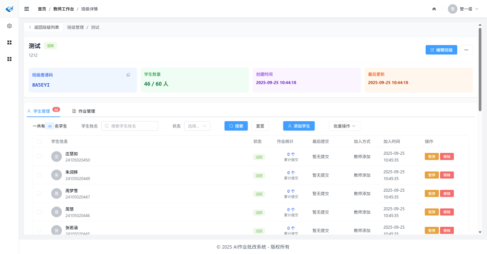


-->

### 4. 学生端学习流程

> 截图占位：展示学生激活账号、学习中心、班级与作业、提交作业、查看批改结果。

<!--
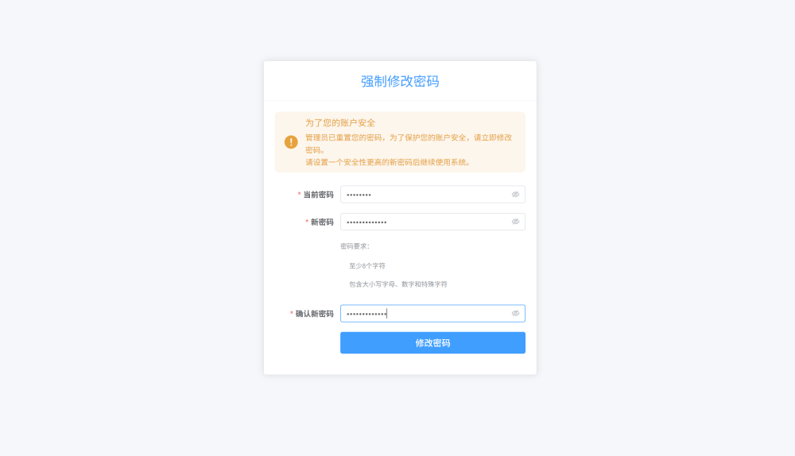
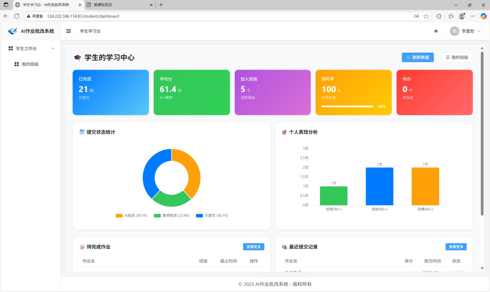
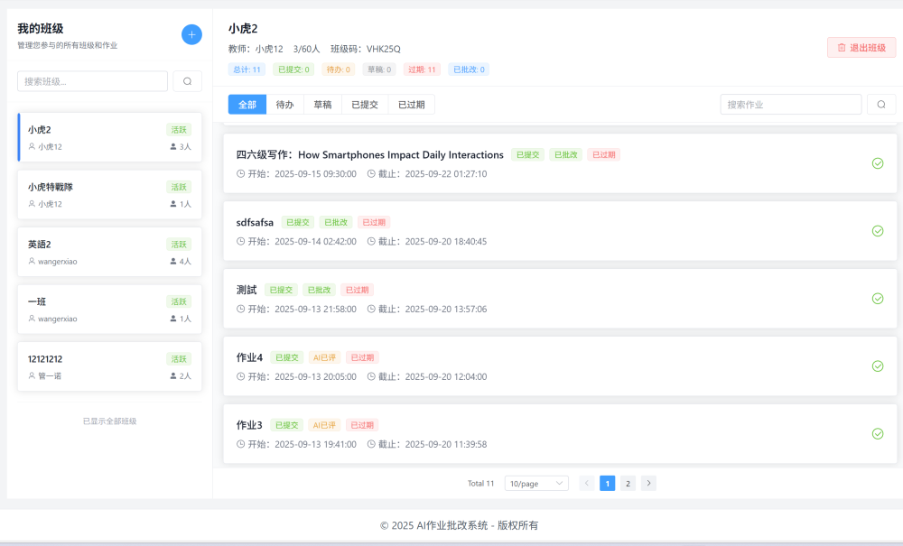

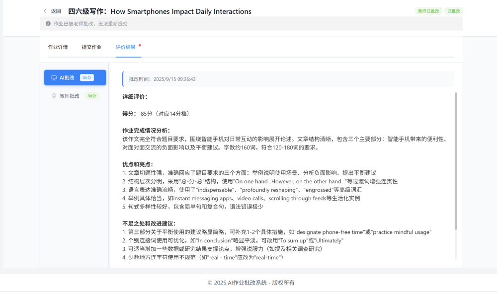
-->

### 5. 动图演示

> 动图占位：展示从学生提交到 AI 批改结果生成的完整流程。

<!--
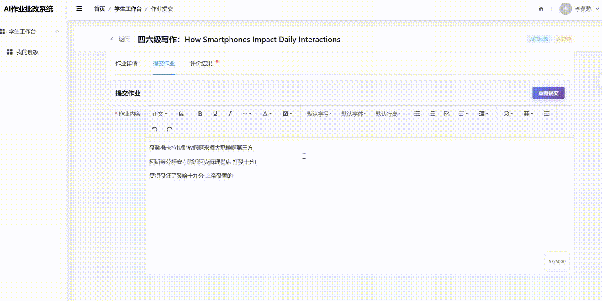
-->

## 系统架构

> 架构图占位：建议展示用户端、业务功能、后端服务、数据库、Redis、AI 模型服务和文件存储的关系。

<!--
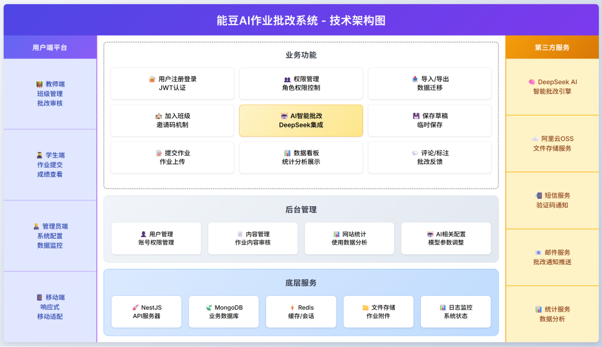
-->

系统采用前后端分离架构：

- 前端负责登录、角色工作台、班级/作业/批改页面、教师工具箱页面和数据展示。
- 后端负责认证授权、业务数据管理、AI 批改任务、文件上传、工具任务处理和系统配置。
- MongoDB 存储用户、角色、班级、作业、提交记录、AI 规则和工具任务。
- Redis / BullMQ 用于 AI 批改和教师工具箱任务的异步队列处理。
- 豆包大模型用于文本作业批改、多模态图片识别、作文检查和结构化结果生成。

## 主要功能

### 管理员端

- 系统概览与基础统计
- 用户管理、批量导入、重置密码
- 角色管理与菜单权限配置
- AI 模型配置与连接测试
- 系统运行数据查看

### 教师端

- 教学中心数据概览
- 班级创建与学生管理
- 作业创建、编辑、发布、终止
- AI 批改规则配置
- 作业提交情况统计
- AI 批改结果查看与人工复核
- 教师工具箱：客观题批分、批量作文检查、工具批改记录

### 学生端

- 学习中心
- 加入和查看班级
- 查看教师发布的作业
- 在线提交作业内容或附件
- 查看 AI 反馈和教师最终评价

### AI 批改闭环

```text
教师创建班级
  -> 添加学生
  -> 创建 AI 批改规则
  -> 发布作业
  -> 学生提交
  -> AI 自动批改
  -> 教师人工复核
  -> 学生查看结果
```

AI 结果只作为辅助判断。教师人工批改结果优先级最高，系统不会用工具箱或 AI 结果覆盖教师已经确认的最终批改。

## 技术栈

| 模块 | 技术 |
| --- | --- |
| 前端 | Vue 3、TypeScript、Vite、Element Plus、Pinia、Vue Router、ECharts、WangEditor |
| 后端 | NestJS、TypeScript、MongoDB、Mongoose、JWT、Passport、Helmet、Throttler |
| 队列 | Redis、BullMQ |
| AI 能力 | 豆包大模型 / 多模态模型 API |
| 部署 | Docker、Docker Compose、Nginx |

## 目录结构

```text
.
├── src/                         # 前端源码
│   ├── api/                     # 前端接口封装
│   ├── components/              # 通用组件
│   ├── layouts/                 # 页面布局
│   ├── router/                  # 路由与权限
│   ├── store/                   # 状态管理
│   └── views/                   # 管理员、教师、学生页面
├── backend/                     # NestJS 后端
│   ├── src/
│   │   ├── auth/                # 登录认证
│   │   ├── users/               # 用户管理
│   │   ├── permissions/         # 角色与菜单权限
│   │   ├── classes/             # 班级管理
│   │   ├── assignments/         # 作业管理
│   │   ├── submissions/         # 提交与 AI 批改
│   │   ├── teacher-tools/       # 教师工具箱
│   │   └── admin/               # 管理端与 AI 模型配置
│   └── test/                    # 后端测试
├── public/README/               # README 截图与动图素材
├── deploy/                      # 部署配置
├── docker-compose.yml           # 生产/通用 Docker 编排
├── docker-compose.dev.yml       # 开发环境 Docker 编排
└── README.MD
```

## 本地开发

### 环境要求

- Node.js 22+（后端建议）
- MongoDB 7+
- Redis 7+（AI 队列推荐配置）
- 豆包模型 API Key（使用 AI 批改时需要）

### 安装依赖

前端：

```bash
npm install
```

后端：

```bash
cd backend
npm install
```

### 后端环境变量

复制后端环境变量模板：

```bash
cd backend
copy .env.example .env
```

常用配置：

```env
PORT=3000
MONGODB_URI=mongodb://127.0.0.1:27017/yosem_ai
JWT_SECRET=replace-with-a-strong-secret
CORS_ORIGINS=http://localhost:5173,http://localhost:3000
REDIS_URL=redis://127.0.0.1:6379
DOUBAO_API_KEY=replace-with-your-doubao-api-key
DOUBAO_BASE_URL=https://ark.cn-beijing.volces.com/api/v3
DOUBAO_MODEL=doubao-seed-2-1-turbo-260628
AI_REVIEW_REQUIRED=false
```

### 启动开发服务

只启动前端：

```bash
npm run dev
```

只启动后端：

```bash
npm run dev:backend
```

同时启动前后端：

```bash
npm run dev:full
```

后端默认运行在 `http://localhost:3000`，前端默认运行在 `http://localhost:5173`。

### 重置开发管理员

```bash
npm run reset:dev-admin
```

## 构建

前端生产构建：

```bash
npm run build
```

后端生产构建：

```bash
cd backend
npm run build
```

后端启动生产产物：

```bash
cd backend
npm run start:prod
```

## Docker 部署

开发环境：

```bash
docker compose -f docker-compose.dev.yml up -d --build
```

通用部署：

```bash
docker compose up -d --build
```

后端生产部署也可以参考 `backend/compose.prod.yml`：

```bash
cd backend
copy .env.production.example .env.production
docker compose -f compose.prod.yml up -d --build
```

生产环境请务必替换：

- `JWT_SECRET`
- `MONGODB_URI`
- `CORS_ORIGINS`
- `REDIS_URL`
- `DOUBAO_API_KEY`
- Nginx 域名和证书配置

## AI 配置说明

系统当前主要接入豆包模型。AI 能力用于：

- 在线作业自动批改
- 客观题答题卡识别
- 作文题目要求提取
- 作文图片识别与批改
- 结构化输出分数、评语、亮点和修改建议

教师可以在教师端自定义模型 ID、API Key 和兼容端点。管理员也可以维护系统级 AI 模型配置。

AI 输出存在不确定性，建议所有正式成绩和重要评价均由教师复核后再发布给学生。

## 教师工具箱

教师工具箱用于处理线下图片类批改任务。

### 客观题批分

适用于周测、单元测试、选择题、填空题等固定答案题型。

流程：

1. 填写任务名称并选择班级。
2. 上传学生答题卡图片。
3. 输入或解析标准答案。
4. 输入或解析分值规则。
5. 创建批分任务。
6. 查看识别与评分结果。
7. 导出 CSV 或同步到关联作业。

### 批量作文检查

适用于作文、短文写作、图片形式的作文批改。

流程：

1. 填写任务名称并选择班级。
2. 输入作文要求或上传题目图片。
3. 上传学生作文图片。
4. 创建检查任务。
5. 查看识别文本、分数、优点、问题和修改建议。
6. 导出或同步结果。

## 隐私与安全

- 不建议在演示截图中展示学生真实姓名、手机号、身份证号、家庭住址等敏感信息。
- AI 批改结果仅作为辅助，不应未经教师复核直接作为最终成绩。
- 生产环境必须使用高强度 `JWT_SECRET`。
- 生产环境必须限制 `CORS_ORIGINS`，不要使用过宽的跨域配置。
- 不要将真实 `.env`、证书私钥、API Key 提交到代码仓库。

## 路线图

已完成或基本完成：

- 多角色登录与权限控制
- 班级管理
- 作业发布与提交
- AI 批改规则配置
- AI 自动批改与教师复核
- 教师工具箱：客观题批分、作文图片检查
- CSV 导出
- Docker 容器化部署配置

计划继续完善：

- 预习任务发布 / 课前任务发布
- 背诵打卡截图检查
- 学情分析
- 知识点遗漏分析
- 线上客观题作答
- 更细粒度的错因归类与个性化学习建议
- 一个智能体：可以总结今日授课内容，给出相应习题，答疑。

## 适用场景

- 中小学教师日常作业批改减负
- 作文、短文写作初评与反馈生成
- 客观题答题卡快速批分
- 班级作业提交与批改过程管理
- 校内 AI 教学应用试点和二次开发

## 说明

本项目仍在快速迭代中，README 中的截图位置已经预留。后续建议补充：

- 首页和登录页截图
- 管理员端截图
- 教师端核心流程截图
- 学生端提交与查看结果截图
- 教师工具箱动图
- 系统架构图

如果你基于本项目做二次开发，建议优先阅读：

- `backend/README.md`
- `src/docs/教师工具箱使用说明书与功能介绍.md`
- `src/docs/教师工具箱深度整合说明.md`
